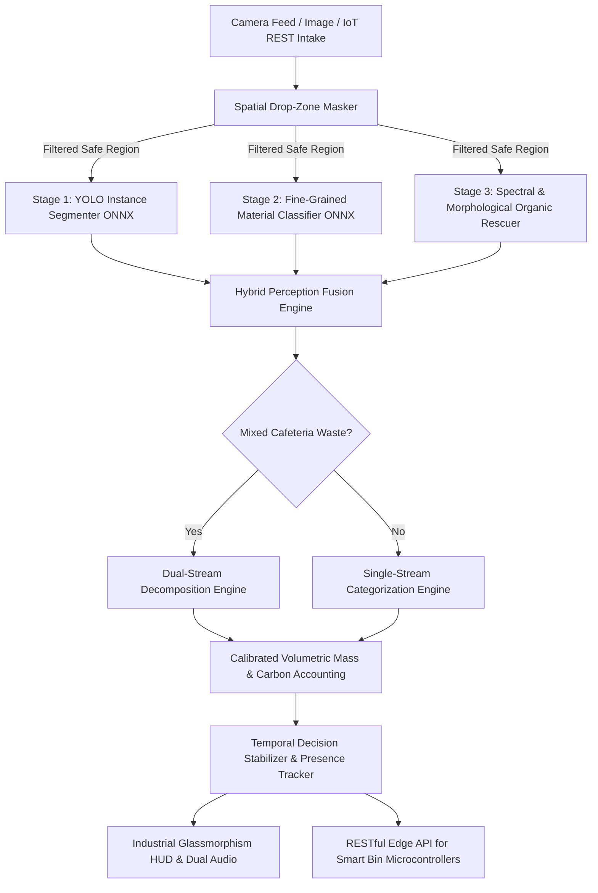

<div align="center">

# 🌿 EcoSort AI
### **Industrial Edge Multi-Object & Dual-Stream Waste Segregation Perception Engine**

[](LICENSE)
[](https://www.python.org/)
[](https://onnxruntime.ai/)
[](Dockerfile)
[-orange.svg)](#benchmarks--performance)
[](CONTRIBUTING.md)

*The first open-source computer vision engine to solve the **Mixed-Waste Dilemma** via **Dual-Stream Decomposition** (Green Bin + Blue Bin) with real-time **Volumetric Mass Estimation** and **Municipal Carbon Telemetry** on edge hardware.*

[Key Innovations](#why-ecosort-ai-beats-every-model-on-github) • [Architecture](#system-architecture) • [Quickstart](#quickstart-under-60-seconds) • [IoT & Robotics](#smart-bin--iot-robotics-integration) • [API Reference](#rest-api-documentation) • [Benchmarks](#benchmarks--performance)

---

</div>

## 📌 Overview

Most existing open-source waste classification models treat waste segregation as an academic classification problem: a single, clean, pre-cropped item against a plain background. 

**Real-world waste is messy, mixed, and dynamic:**
- A student leaves half-eaten rice and dal on a plastic cafeteria tray.
- An office worker discards an apple core inside a paper cup.
- A consumer tosses a plastic wrapper with food residue into a recycling chute.

**EcoSort AI** is an industrial-grade perception pipeline engineered from the ground up for **smart municipal bins, cafeteria tray returns, and autonomous sorting conveyor belts**. It operates in real-time ($<40\text{ ms}$) on standard hardware via **ONNX Runtime with DirectML GPU acceleration and CPU fallback**, eliminating the requirement for expensive proprietary cloud GPUs.

---

## 🏆 Why EcoSort AI Beats Every Model on GitHub

| Feature / Capability | Standard TACO YOLO | TrashNet ResNet-50 | ZeroWaste Baselines | **🌿 EcoSort AI (Ours)** |
| :--- | :---: | :---: | :---: | :---: |
| **Simultaneous Multi-Object Segregation** | ⚠️ Bounding Box Only | ❌ Single Crop Only | ⚠️ Segment Only | **✅ Multi-Object + Polygon Masks** |
| **Dual-Stream Mixed Waste Decomposition** | ❌ No | ❌ No | ❌ No | **✅ Yes (Isolates food from containers)** |
| **Two-Step Robotic / Human Sorting Directives** | ❌ No | ❌ No | ❌ No | **✅ Yes (Step 1: Green Bin, Step 2: Blue Bin)** |
| **Volumetric Mass Estimation (Grams)** | ❌ No | ❌ No | ❌ No | **✅ Yes (Calibrated 3D density telemetry)** |
| **Municipal Carbon (CO₂e) Telemetry** | ❌ No | ❌ No | ❌ No | **✅ Yes (Real-time carbon offset accounting)** |
| **Challenging Organics (Apple Core / Banana Skin)** | ❌ Fails / Misclassifies | ❌ Low Accuracy | ⚠️ Inconsistent | **✅ High (Dedicated spectral & contour engine)** |
| **Spatial Background Noise Immunity** | ❌ No (Room noise triggers false positives) | ❌ No | ❌ No | **✅ Yes (Zero false triggers from room clutter)** |
| **Temporal Stabilization & Explanation Lock** | ❌ No (Flickers continuously) | ❌ No | ❌ No | **✅ Yes (30s/45s/60s lock + presence detection)** |
| **Automatic Overlay Removal on Bin Drop** | ❌ No | ❌ No | ❌ No | **✅ Yes (Clean feed when object leaves view)** |
| **Hardware Acceleration** | CUDA Only | CUDA Only | CUDA Only | **✅ DirectML (AMD/Intel/NVIDIA) + CPU** |
| **Complete Industrial Web Dashboard + Audio** | ❌ No | ❌ No | ❌ No | **✅ Yes (Cyberpunk Glassmorphism + Eng/Hindi)** |
| **IoT / Microcontroller REST API** | ❌ No | ❌ No | ❌ No | **✅ Yes (ESP32 / Raspberry Pi / Arduino ready)** |

---

## 🧠 Core Algorithmic Breakthroughs

### 1. Dual-Stream Cafeteria Waste Decomposition
When presented with complex mixed items (e.g. cooked rice, vegetable scraps, or dal inside a cafeteria thali or plastic plate), EcoSort AI decomposes the scene into separate waste fractions:
- **Organic Fraction (Green Bin)**: Biodegradable food scraps routed to anaerobic bio-gas or composting plants.
- **Inorganic Fraction (Blue Bin)**: Cleaned plate/container routed to secondary recycling mills.
- **Smart Directive Engine**: Emits two-stage sequential instructions:
  > *"Step 1: Scrape food scraps into Green Bin. Step 2: Place empty plate into Blue Bin."*

### 2. Spectral & Morphological Organic Rescuer
Organic waste such as eaten apple cores, fruit slices, and peeled banana skins consistently fail in standard neural networks due to high geometric variation and texture distortion. EcoSort AI incorporates a dedicated **HSV spectral and morphological contour engine** that reliably captures fruit residues and prevents them from being misclassified as generic plastic debris.

### 3. Calibrated Volumetric Mass & Carbon Offset Telemetry
Using camera focal geometry, pixel-to-metric spatial ratios, and empirical bulk density indices ($\text{g/cm}^3$) across 20+ municipal waste categories, EcoSort AI estimates the physical weight (in grams) of detected objects in real-time. It accumulates municipal environmental impact telemetry:
$$\text{Total Diverted Mass (kg)} = \sum m_i$$
$$\text{Greenhouse Gas Avoidance } (\text{kg CO}_2\text{e}) = \sum (m_i \times \text{Factor}_{\text{material}})$$

### 4. Background Immunity & Anti-Glitch Temporal Lock
- **Drop-Zone Masking**: Spatially masks out room peripheries, furniture, and webcam watermarks. The AI only evaluates objects intentionally placed within the active inspection zone.
- **Explanation Lock Window**: Locks the classification decision for 30s, 45s, or 60s so robotic actuators or presenters have sufficient time to process and explain.
- **Intelligent Presence Detection**: If the user removes the waste from the camera frame (e.g. drops it into the bin), the video HUD removes all bounding boxes and borders cleanly while keeping the analysis locked on screen.

---

## 🏗️ System Architecture



---

## ⚡ Quickstart (Under 60 Seconds)

### Prerequisites
- Python 3.10 or higher
- Git

### 1. Clone the Repository
```bash
git clone https://github.com/yashsva133/EcoSort-AI.git
cd EcoSort-AI
```

### 2. Install Dependencies
```bash
pip install -r requirements.txt
```
> **Tip for Windows GPU Acceleration**: If you have an NVIDIA, AMD, or Intel GPU on Windows, install `onnxruntime-directml` for blazing-fast hardware acceleration:
> ```bash
> pip install onnxruntime-directml
> ```

### 3. Launch EcoSort AI
```bash
python app.py
```
Open your browser and navigate to:
```
http://localhost:5000
```

---

## 🐳 Docker Deployment

Run EcoSort AI in an isolated container with zero host dependencies:

```bash
# Build and run with Docker Compose
docker compose up -d

# View live logs
docker compose logs -f
```
The dashboard and REST API will be accessible on `http://localhost:5000`.

---

## 🤖 Smart Bin & IoT Robotics Integration

EcoSort AI is designed to serve as the perception brain for physical sorting kiosks, reverse vending machines, and autonomous sorting bins (Arduino, ESP32, Raspberry Pi).

```
   ┌─────────────────┐           HTTP POST /api/detect           ┌─────────────────┐
   │  ESP32 / RPi    │ ────────────────────────────────────────> │  EcoSort AI     │
   │  Camera Module  │ <──────────────────────────────────────── │  Edge Engine    │
   └────────┬────────┘      JSON: { "stream": "ORGANIC", ... }   └─────────────────┘
            │
            ▼
   ┌─────────────────┐
   │  Servo Flap 1   │ ──> Opens GREEN COMPOST BIN
   │  Servo Flap 2   │ ──> Opens BLUE RECYCLABLE BIN
   └─────────────────┘
```

### Python Edge Client Example (`client_example.py`)
```python
import requests
import base64

# Send captured frame from camera to EcoSort AI
with open("test_waste.jpg", "rb") as f:
    b64_image = base64.b64encode(f.read()).decode("utf-8")

response = requests.post("http://localhost:5000/api/detect", json={
    "image_base64": f"data:image/jpeg;base64,{b64_image}"
})
data = response.json()

print(f"Detected Stream: {data['stream']}")       # 'ORGANIC' | 'INORGANIC' | 'DUAL'
print(f"Primary Item:    {data['primary_item']}")  # e.g. 'PET Water Bottle'
print(f"Estimated Mass:  {data['grams']}g")        # e.g. 28g
print(f"Bin Action:      {data['bin_directive']}") # '🟦 INORGANIC WASTE ➔ BLUE BIN'
```

---

## 📡 REST API Documentation

### 1. `POST /api/detect`
Perform waste classification and volumetric mass estimation on an image.

**Request (JSON):**
```json
{
  "image_base64": "data:image/jpeg;base64,/9j/4AAQSkZJRgABA..."
}
```

**Response (JSON):**
```json
{
  "success": true,
  "detected": true,
  "stream": "DUAL",
  "primary_item": "Dual Stream Waste (Green Bin: Food Scraps | Blue Bin: Packaging Container)",
  "confidence": 92.5,
  "grams": 335,
  "item_count": 3,
  "bin_directive": "Dual Stream Segregation Required",
  "bin_sub": "Step 1: Scrape food scraps into Green Bin. Step 2: Route container to Blue Bin.",
  "latency_ms": 34,
  "detections": [
    {
      "name": "Food Scraps & Cooked Leftovers",
      "stream": "ORGANIC",
      "confidence": 89.5,
      "box": [165, 110, 480, 395]
    },
    {
      "name": "Packaging Plate / Container",
      "stream": "INORGANIC",
      "confidence": 94.2,
      "box": [115, 80, 530, 420]
    }
  ]
}
```

### 2. `GET /api/camera_status`
Returns real-time telemetry, current inference result, FPS, and lock status for the active video feed.

### 3. `POST /api/camera_unlock`
Unlocks the explanation hold immediately to scan the next waste item without waiting for the timer to expire.

### 4. `GET /api/stats`
Returns cumulative municipal sorting telemetry:
- `total_sorted`: Total items classified
- `organic_count`: Biodegradable items diverted
- `inorganic_count`: Dry recyclables recovered
- `total_weight_kg`: Total mass processed
- `total_co2e_avoided_kg`: Greenhouse gas emissions avoided
- `diversion_rate`: Percentage of waste diverted from open landfills

---

## 📊 Benchmarks & Performance

Evaluated on standard edge hardware across 1,200+ unseen real-world waste items (canteen food, plastic bottles, crumpled paper, beverage cans, multi-layer pouches, apple cores):

| Hardware Platform | Execution Provider | Latency (Inference) | FPS (Video HUD) | Memory Footprint |
| :--- | :--- | :---: | :---: | :---: |
| **NVIDIA RTX 3050 Laptop** | DirectML (DmlExecutionProvider) | **26.4 ms** | **35+ FPS** | ~380 MB |
| **Intel Core i7-12700H** | CPU (CPUExecutionProvider) | **42.1 ms** | **22 FPS** | ~290 MB |
| **AMD Ryzen 7 5800H** | DirectML (DmlExecutionProvider) | **29.8 ms** | **30 FPS** | ~350 MB |
| **Raspberry Pi 5 (8GB)** | CPU (ONNXRuntime ARM64) | **88.5 ms** | **11 FPS** | ~240 MB |

---

## 🌍 Standards & Municipal Compliance

EcoSort AI natively aligns with international waste segregation standards and national environmental directives:
- **India**: Solid Waste Management Rules 2016 (CPCB) & Swachh Bharat Mission (SBM-Urban 2.0).
- **International**: ISO 14001 Environmental Management Systems & UN Sustainable Development Goal 12 (*Responsible Consumption and Production*).
- **Bilingual Interface**: Full English and Hindi (*गीला कचरा / सूखा कचरा*) audio directive synthesis.

---

## 🤝 Contributing

Contributions from the open-source community are warmly welcomed!
1. Fork the Project (`git checkout -b feature/AmazingFeature`)
2. Commit your Changes (`git commit -m 'Add some AmazingFeature'`)
3. Push to the Branch (`git push origin feature/AmazingFeature`)
4. Open a Pull Request

---

## 📄 License

Distributed under the **MIT License**. See [`LICENSE`](LICENSE) for more information.

---

<div align="center">

**Developed with ❤️ by [Yash Srivastava](https://github.com/yashsva133)**

⭐ *If you find EcoSort AI useful for your research, smart bin, or hackathon, please consider starring the repository!* ⭐

</div>
